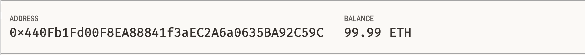
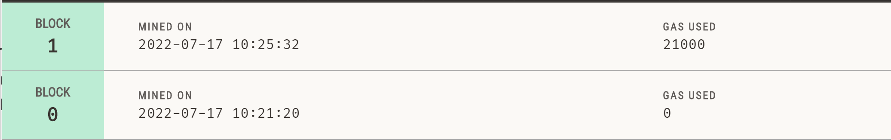
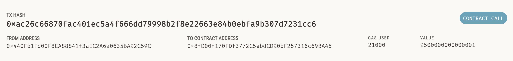
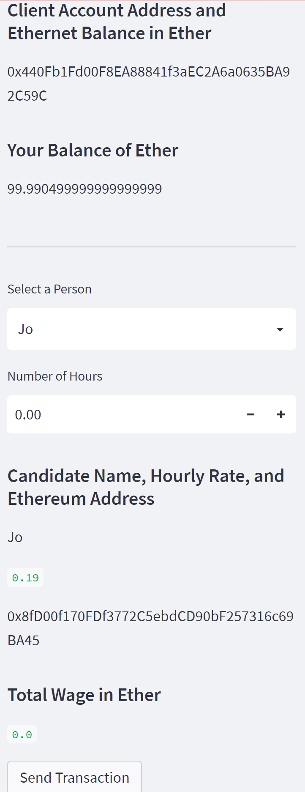
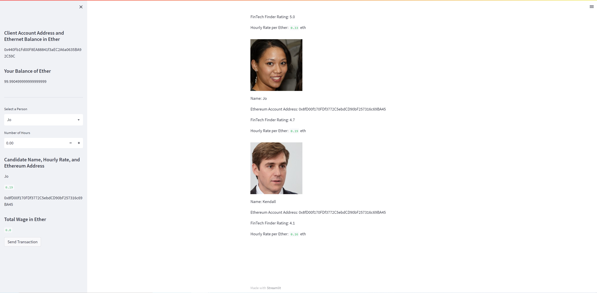

## Unit 19: Cryptocurrency Wallet
### Richie Garafola - July 2022

Instructions
The steps for this challenge are broken out into the following sections:

- Import Ethereum Transaction Functions into the Fintech Finder Application
- Sign and Execute a Payment Transaction
- Inspect the Transaction on Ganache

## Inspect the Transaction:

Step 3: Inspect the Transaction
Now it's time to put it all together and test the Fintech Finder application with your newly integrated Ethereum wallet. You will send a test transaction by using the application’s web interface, and then look up the resulting transaction in Ganache. To do so, complete the following steps:

From your terminal, navigate to the project folder that contains your .env file and the fintech_finder.py and crypto_wallet.py files. Be sure to activate your Conda dev environment if it is not already active.

To launch the Streamlit application, type streamlit run fintech_finder.py.

On the resulting webpage, select a candidate that you would like to hire from the appropriate drop-down menu. Then, enter the number of hours that you would like to hire them for. (Remember, you do not have a lot of ether in your account, so you cannot hire them for long!)

Click the Send Transaction button to sign and send the transaction with your Ethereum account information. Navigate to the Transactions section of Ganache.

Take a screenshot of your address balance and history on Ganache. Save this screenshot to the README.md file of your GitHub repository for this Challenge assignment.

Take a screenshot of the transaction details on Ganache. Save this screenshot to the README.md file of your GitHub repository for this Challenge assignment.

Return to the original transaction, and click the transaction’s To address.

Take a screenshot of the recipient’s address balance and history from your Ganache application. Save this screenshot to the README.md file of your GitHub repository for this Challenge assignment.

---

# Appendix    

---

