# Unit 6 - Pythonic Monopoly

*[San Francisco Park Reading by Juan Salamanca](https://www.pexels.com/photo/park-san-francisco-reading-61109/) | [Free License](https://www.pexels.com/photo-license/)*

## Background

Harold's company has just started a new Real Estate Investment division to provide customers with a broader range of portfolio options. Harold was tasked with building a prototype dashboard and he needs your help. The real estate team wants to trial this initial offering with investment opportunities for the San Francisco market. If the new service is popular, then they can start to expand to other markets.

The goal of this dashboard is to provide charts, maps, and interactive visualizations that help customers explore the data and determine if they want to invest in rental properties in San Francisco.

In this homework assignment, you will help Harold accomplish the following tasks:

1. [Complete a notebook of rental analysis](#Rental-Analysis).

2. [Create a dashboard of interactive visualizations to explore the market data](#Dashboard).

**Note:** If you encounter technical difficulties using PyViz, refer to the troubleshooting section of the [PyViz Installation Guide](PyVizInstallationGuide.md).

---

## Files

* [sfo_neighborhoods_census_data.csv](Starter_Code/Data/sfo_neighborhoods_census_data.csv)
* [neighborhoods_coordinates.csv](Starter_Code/Data/neighborhoods_coordinates.csv)
* [Rental Analysis Starter Jupyter Notebook](Starter_Code/rental_analysis.ipynb)
* [Dashboard Starter Jupyter Notebook](Starter_Code/dashboard.ipynb)

## Instructions

### Rental Analysis

The first step to building the dashboard is to work out all of the calculations and visualizations in an analysis notebook. Once the code is worked out here, it can be copied over to a dashboard code and used with Panel to create the final layout. Use the `rental_analysis.ipynb` to complete the following:

#### Housing Units Per Year

In this section, you will calculate the number of housing units per year and visualize the results as a bar chart using the Pandas plot function.

Note: By default, the limits auto-scale to the data. However, it is hard to see the difference between the yearly data. In the optional challenge, you can use the min, max, and standard deviation of the data to manually scale the y limits of the plot.

Default Bar Chart

  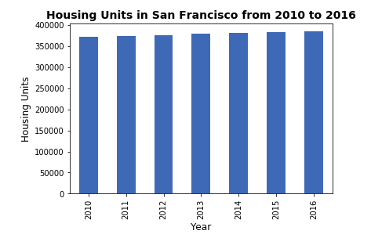

Bar Chart with y-axis limits adjusted

  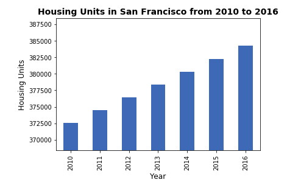

#### Average Housing Costs in San Francisco Per Year

In this section, you want to determine the average sales price per year and the average gross rent per year to better understand housing costs over time. For example, a customer will want to know if they should expect an increase or decrease in the property value or rent over time so they can determine how long to hold the rental property. You will visualize the average (mean) gross rent and average price per square foot per year and visualize it as a bar chart.

1. Calculate the mean `gross_rent` and `sale_price_sqr_foot` for each year.
2. Visualize the mean `gross_rent` and `sale_price_sqr_foot` for each year as two line charts.

  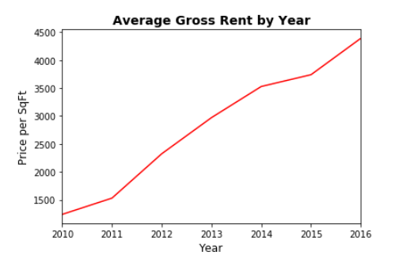

  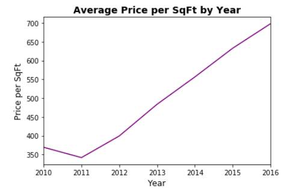

#### Average Prices By Neighborhood

In this section, you will use hvplot to create two interactive visulizations of average prices with a dropdown selector for the neighborhood. The first visualization will be a line plot showing the trend of average price per square foot over time for each neighborhood.  The second will be a line plot showing the trend of average montly rent over time for each neighborhood.

**Hint:** It will be easier to create a new DataFrame from grouping the data and calculating the mean prices for each year and neighborhood.

  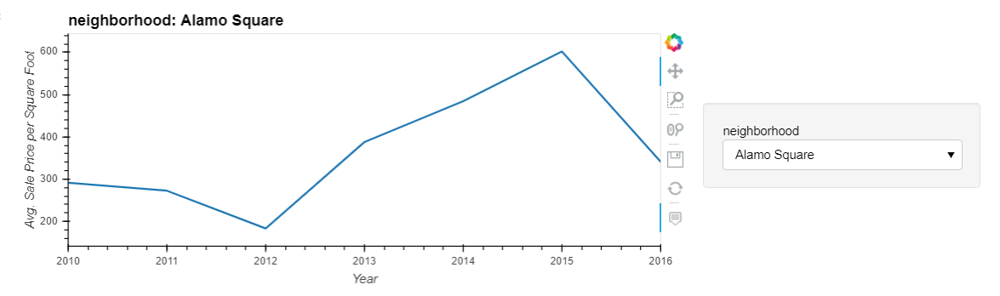
  
  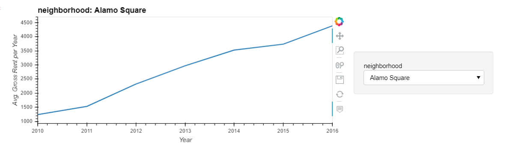

#### Top 10 Most Expensive Neighborhoods

In this section, you want to figure out which neighborhoods are the most expensive. You will need to calculate the mean sale price for each neighborhood and then sort the values to obtain the top 10 most expensive neighborhoods on average. Plot the results as a bar chart.

  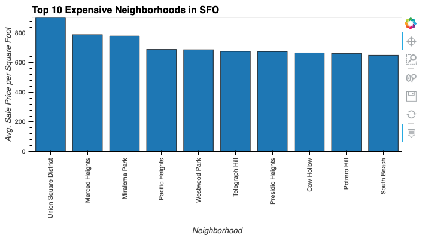

#### Comparing Cost to Purchase Versus Rental Income

In this section, you will use `hvplot` to create an interactive visualization with a dropdown selector for the neighborhood. This visualization will feature a side-by-side comparison of average price per square foot versus average monthly rent by year.

**Hint:** Use the `hvplot` parameter, `groupby`, to create a dropdown selector for the neighborhood.

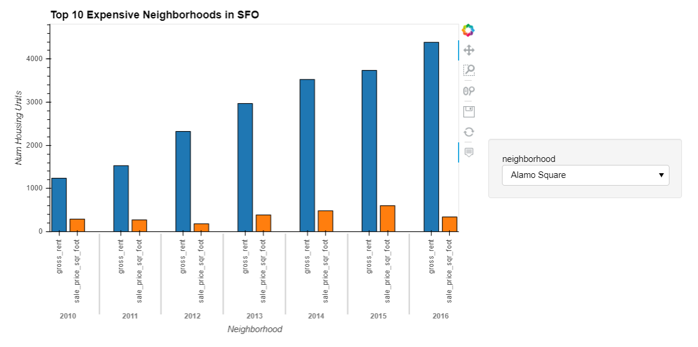

#### Neighborhood Map

In this final section, you will read in neighborhood location data and build an interactive map with the average prices per neighborhood. Use a scatter mapbox object from plotly express to create the visualization. Remember, you will need your mapbox API key for this.

Remember that in order to create maps visualizations using Plotly Express, you will need to create an account at [mapbox](https://www.mapbox.com/) and [create an access token](https://docs.mapbox.com/help/how-mapbox-works/access-tokens/#creating-and-managing-access-tokens).

  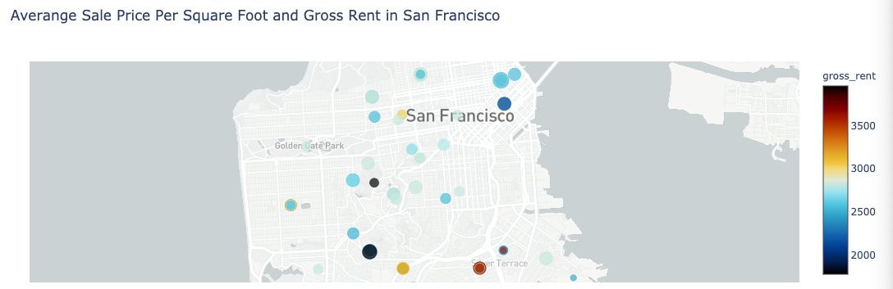

####  Cost Analysis - Optional Challenge

In this optional challenge section, you will use plotly express to create a Parallel Coordinates plot, Parallel Categories plot, and a Sunburst plot so that investors can interactively filter and explore various factors related to the sales price of the neighborhoods.

Using the provided DataFrame to create the following visualizations:

1. Create a Parallel Coordinates Plot.

  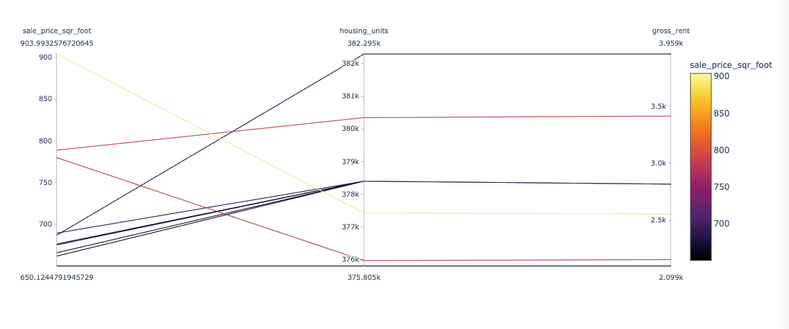

2. Create a Parallel Categories Plot.

  

3. Create a Sunburst plot to show the most expensive neighborhoods in San Francisco per year.

    **Hint:** You can learn more about sunburst charts in Plotly Express in [this link](https://plotly.com/python/sunburst-charts/).

    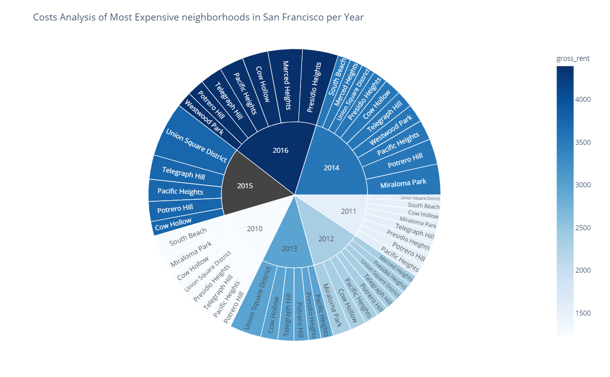
 
---

### Dashboard

Now that you have worked out all of the code and analysis, you will use the Panel library to build an interactive dashboard for all of the visualizations. There are no hard requirements for the layout of this dashboard, so use your own imagination and creativity!

Use the provided starter notebook, `dashboard.ipynb`, for your dashboard code. Copy the code for each visualization from the analysis notebook and place it into separate functions (1 function per visualization). This will make it easier to build and modify the layout later. Each function should return the plot figure in a format that Panel can use to plot the visualization.

Sample Dashboard:

  

### Submission

* Use the starter notebooks for the analysis and dashboard and upload these to Github.

* Complete your README to explain how to run and use your dashboard.

* Note: You should not submit your `mapbox` access token to Github!

* Submit the Github URL repository to Bootcampspot.

---

### Requirements

#### Rental Analysis  (10 points)

##### To receive all points, your code must:

* Calculate the number of housing units per year. (5 points)
* Create a bar chart visualization of the rental analysis results. (5 points)

#### Average Housing Costs in San Francisco per Year (10 points)

##### To receive all points, your code must:

* Calculate the average gross rents and sales prices per year. (5 points)
* Generate line plots that show the gross rents and sales prices per year. (5 points)

#### Average Prices by Neighborhood (10 points)

##### To receive all points, your code must:

* Calculate the `sales_price_per_sqr_foot` and `gross_rent` for each year. (5 points)
* Generate line plots using hvPlot to show the `sales_price_per_sqr_foot` and `gross_rent` per year. (5 points)

#### Top 10 Most Expensive Neighborhoods (10 points)

##### To receive all points, your code must:

* Create a dataFrame with the mean house values by neighborhood per year. (5 points)
* Create a visualization using hvPlot to show the `average_house_value` mean per year, adding a neighborhood dropdown selector option. (5 points)

#### Comparing Cost to Purchase Versus Rental Income (10 points)

##### To receive all points, your code must:

* Use hvPlot to generate a bar chart that compares sales price and gross rents side by side. (5 points)
* Add a neighborhood dropdown selector option using hvPlot. (5 points)

#### Neighborhood Map (10 points)

##### To receive all points, your code must:

* Create a DataFrame joining the neighborhood location data with the rent and sales data. (5 points)
* Generate an interactive map with average prices per neighborhood. (5 points)

#### Interactive Dashboard (10 points)

##### To receive all points, your code must:

* Copy the code for each visualization from the analysis notebook and place it into separate functions. (5 points)
* Use the Panel library in conjunction with these functions to build an interactive dashboard for all of the visualizations. (5 points)

#### Optional Bonus - Cost Analysis (30 points)

##### To receive all bonus points, your code must:

* Create a parallel coordinates plot to show the most expensive neighborhoods in San Francisco per year. (10 points)
* Create a parallel categories plot to show the most expensive neighborhoods in San Francisco per year. (10 points)
* Create a sunburst plot to show the most expensive neighborhoods in San Francisco per year. (10 points)

#### Coding Conventions and Formatting (10 points)

##### To receive all points, your code must:

* Place imports at the beginning of the file, just after any module comments and docstrings and before module globals and constants. (3 points)
* Name functions and variables with lowercase characters and with words separated by underscores. (2 points)
* Follow Don't Repeat Yourself (DRY) principles by creating maintainable and reusable code. (3 points)
* Use concise logic and creative engineering where possible. (2 points)

#### Deployment and Submission (10 points)

##### To receive all points, you must:

* Submit a link to a GitHub repository that’s cloned to your local machine and contains your files. (5 points)
* Include appropriate commit messages in your files. (5 points)

#### Code Comments (10 points)

##### To receive all points, your code must:

* Be well commented with concise, relevant notes that other developers can understand. (10 points)

---

© 2021 Trilogy Education Services, a 2U, Inc. brand. All Rights Reserved.
