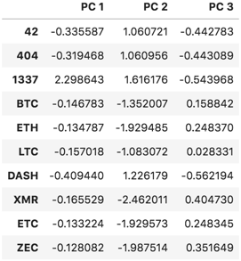

# Unit 13 Homework Assignment 

# Clustering Crypto


_[Cryptocurrencies coins by Worldspectrum](https://www.pexels.com/@worldspectrum?utm_content=attributionCopyText&utm_medium=referral&utm_source=pexels) | [Free License](https://www.pexels.com/photo-license/)_

### Background

You are a Senior Manager at the Advisory Services team on a [Big Four firm](https://en.wikipedia.org/wiki/Big_Four_accounting_firms). One of your most important clients, a prominent investment bank, is interested in offering a new cryptocurrencies investment portfolio for its customers, however, they are lost in the immense universe of cryptocurrencies. They ask you to help them make sense of it all by generating a report of what cryptocurrencies are available on the trading market and how they can be grouped using classification.

In this homework assignment, you will put your new unsupervivsed learning and Amazon SageMaker skills into action by clustering cryptocurrencies and creating plots to present your results.

You are asked to accomplish the following main tasks:

- **[Data Preprocessing](#Data-Preprocessing):** Prepare data for dimension reduction with PCA and clustering using K-Means.

- **[Reducing Data Dimensions Using PCA](#Reducing-Data-Dimensions-Using-PCA):** Reduce data dimension using the `PCA` algorithm from `sklearn`.

- **[Clustering Cryptocurrencies Using K-Means](#Clustering-Cryptocurrencies-Using-K-Means):** Predict clusters using the cryptocurrencies data using the `KMeans` algorithm from `sklearn`.

- **[Visualizing Results](#Visualizing-Results):** Create some plots and data tables to present your results.

- **[Optional Challenge](#Optional-Challenge):** Deploy your notebook to Amazon SageMaker.

---

### Files

- [crypto_clustering.ipynb](Starter_Files/crypto_clustering.ipynb)

---

### Instructions

#### Data Preprocessing

In this section, you will load the information about cryptocurrencies and perform data preprocessing tasks. You can choose one of the following methods to load the data:

1. Using the provided `CSV` file, create a `Path` object and read the file data directly into a DataFrame named `crypto_df` using `pd.read_csv()`.

2. Using the following `requests` library, retreive the necessary data from the following API endpoint from _CryptoCompare_ - `https://min-api.cryptocompare.com/data/all/coinlist`. **HINT:** You will need to use the 'Data' key from the json response, then transpose the DataFrame. Name your DataFrame `crypto_df`.

With the data loaded into a Pandas DataFrame, continue with the following data preprocessing tasks.

3. Keep only the necessary columns: 'CoinName','Algorithm','IsTrading','ProofType','TotalCoinsMined','TotalCoinSupply'

4. Keep only the cryptocurrencies that are trading.

5. Keep only the cryptocurrencies with a working algorithm.

6. Remove the `IsTrading` column.

7. Remove all cryptocurrencies with at least one null value.

8. Remove all cryptocurrencies that have no coins mined.

9. Drop all rows where there are 'N/A' text values.

10. Store the names of all cryptocurrencies in a DataFrame named `coins_name`, use the `crypto_df.index` as the index for this new DataFrame.

11. Remove the `CoinName` column.

12. Create dummy variables for all the text features, and store the resulting data in a DataFrame named `X`.

13. Use the [`StandardScaler` from `sklearn`](https://scikit-learn.org/stable/modules/generated/sklearn.preprocessing.StandardScaler.html) to standardize all the data of the `X` DataFrame. Remember, this is important prior to using PCA and K-Means algorithms.

#### Reducing Data Dimensions Using PCA

Use the [`PCA` algorithm from `sklearn`](https://scikit-learn.org/stable/modules/generated/sklearn.decomposition.PCA.html) to reduce the dimensions of the `X` DataFrame down to three principal components.

Once you have reduced the data dimensions, create a DataFrame named `pcs_df` using as columns names `"PC 1", "PC 2"` and `"PC 3"`; use the `crypto_df.index` as the index for this new DataFrame.

You should have a DataFrame like the following:



#### Clustering Cryptocurrencies Using K-Means

In this section, you will use the [`KMeans` algorithm from `sklearn`](https://scikit-learn.org/stable/modules/generated/sklearn.cluster.KMeans.html) to cluster the cryptocurrencies using the PCA data.

Perform the following tasks:

1. Create an Elbow Curve to find the best value for `k` using the `pcs_df` DataFrame.

2. Once you define the best value for `k`, run the `Kmeans` algorithm to predict the `k` clusters for the cryptocurrencies data. Use the `pcs_df` to run the `KMeans` algorithm.

3. Create a new DataFrame named `clustered_df`, that includes the following columns `"Algorithm", "ProofType", "TotalCoinsMined", "TotalCoinSupply", "PC 1", "PC 2", "PC 3", "CoinName", "Class"`. You should maintain the index of the `crypto_df` DataFrames as is shown bellow.

   

#### Visualizing Results

In this section, you will create some data visualization to present the final results. Perform the following tasks:

1. Create a scatter plot using `hvplot.scatter`, to present the clustered data about cryptocurrencies having `x="TotalCoinsMined"` and `y="TotalCoinSupply"` to contrast the number of available coins versus the total number of mined coins. Use the `hover_cols=["CoinName"]` parameter to include the cryptocurrency name on each data point.

2. Use `hvplot.table` to create a data table with all the current tradable cryptocurrencies. The table should have the following columns: `"CoinName", "Algorithm", "ProofType", "TotalCoinSupply", "TotalCoinsMined", "Class"`

### Optional Challenge

For the challenge section, you have to upload your Jupyter notebook to Amazon SageMaker and deploy it.

The `hvplot` library is not included in the built-in anaconda environments, so for this challenge section, you should use the `altair` library instead.

Perform the following tasks:

1. Upload your Jupyter notebook and rename it as `crypto_clustering_sm.ipynb`

2. Select the `conda_python3` environment.

3. Install the `altair` library by running the following code before the initial imports.

   ```python
   !pip install -U altair
   ```

4. Use the `altair` scatter plot to create the Elbow Curve.

5. Use the `altair` scatter plot to visualize the clusters. Since this is a 2D-Scatter, use `x="PC 1"` and `y="PC 2"` for the axes, and add the following columns as tool tips: `"CoinName", "Algorithm", "TotalCoinsMined", "TotalCoinSupply"`.

6. Use the `altair` scatter plot to visualize the tradable cryptocurrencies using `x="TotalCoinsMined"` and `y="TotalCoinSupply"` for the axes.

7. Show the table of current tradable cryptocurrencies using the `display()` command.

8. Remove all `hvplot` references from your code.

#### Complementary Resources

- [Altair visualization library website](https://altair-viz.github.io/).

- [Simple line chart using Altair](https://altair-viz.github.io/gallery/simple_line_chart.html).

- [Simple Scatter Plot with Tooltips using Altair](https://altair-viz.github.io/gallery/scatter_tooltips.html)

- [Color customization on Altair](https://github.com/altair-viz/altair/issues/921#issuecomment-395416682)

- [Printing all rows from a DataFrame](https://stackoverflow.com/a/30691921/4325668)

- [Install External Libraries and Kernels in Amazon SageMaker Notebook Instances](https://docs.aws.amazon.com/sagemaker/latest/dg/nbi-add-external.html)

### Submission

- Code your solution using the provided starter Jupyter notebook.

- For the _Challenge_ section, create a new Jupyter notebook named `crypto_clustering_sm.ipynb` and include the necessary code to import the additional required library.

- Create and upload a repository with the above files to GitHub and post a link in BootCamp Spot.

### Requirements

<summary>Clustering Crypto</summary>

#### Data Preprocessed (18 points)

##### To receive all points, your code must:

- Load the data into a Pandas DataFrame named `crypto_df`. (9 points)
- Complete all assigned data preprocessing tasks. (9 points)

#### Data Dimension Reduced (12 points)

##### To receive all points, your code must:

- Use the PCA algorithm from sklearn to reduce dimensions. (7 points)
- Create a DataFrame named `pcs_df` using `crypto_df.index` as the index. (5 points)

#### Cryptocurrency Clustered (25 points)

##### To receive all points, your code must:

- Use K-Means to cluster the cryptocurrencies using PCA data. (7 points)
- Use the Elbow Curve with the `pcs_df` DataFrame to find the best value for k. (7 points)
- Use the Kmeans algorithm to predict the k clusters for the cryptocurrency data. (7 points)
- Create a new DataFrame named `clustered_df` that includes the assigned columns and index. (4 points)

#### Visualizing Results (15 points)

##### To receive all points, your code must:

- Create a Data table with the assigned columns using `hvplot.table` for all current tradable cryptocurrencies. (8 points)
- Create a scatter plot using `hvplot.scatter` that presents the clustered data using the assigned parameters. (7 points)

#### Optional Bonus: AWS Sagemaker Deployment (20 points)

##### To receive all points, your code must:

- Optional: Upload and deploy the Jupyter notebook using Amazon SageMaker. (20 points)

#### Coding Conventions and Formatting (10 points)

##### To receive all points, your code must:

- Place imports at the beginning of the file, just after any module comments and docstrings and before module globals and constants. (3 points)
- Name functions and variables with lowercase characters and with words separated by underscores. (2 points)
- Follow Don't Repeat Yourself (DRY) principles by creating maintainable and reusable code. (3 points)
- Use concise logic and creative engineering where possible. (2 points)

#### Deployment and Submission (10 points)

##### To receive all points, you must:

- Submit a link to a GitHub repository that’s cloned to your local machine and contains your files. (5 points)
- Include appropriate commit messages in your files. (5 points)

#### Code Comments (10 points)

##### To receive all points, your code must:

- Be well commented with concise, relevant notes that other developers can understand. (10 points)

</details>

---

© 2021 Trilogy Education Services, a 2U, Inc. brand. All Rights Reserved.
